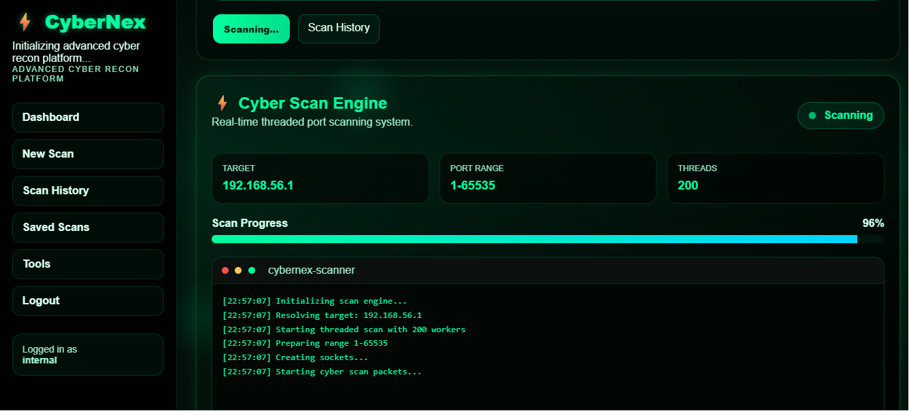
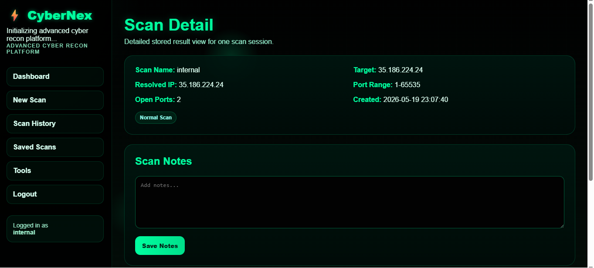

# Advanced Port Scanner - Ultimate Pro Max

A modern Flask-based advanced port scanner with multi-threading, OS detection, and Geo-IP lookup.

---

# Features

- Multi-threaded scanning
- Fast port detection
- OS detection
- Geo-IP lookup
- Modern UI dashboard
- SQLite database support

---

# Installation

```bash
pip install -r requirements.txt
python init_db.py
python app.py
```

---

# Open In Browser

```text
http://127.0.0.1:5000
```

---

# Project Structure

```bash
advance-port-scanner/
│
├── modules/
├── static/
├── templates/
├── utils/
├── app.py
├── init_db.py
├── launcher.py
├── schema.sql
└── requirements.txt
```

---
## 📸 Screenshots

### Login Page


### Homepage


### Scanning Process


### Scan Details


# Disclaimer

This tool is for educational and authorized security testing purposes only.

---

# Author

Shiva Rama Krishna

GitHub:
https://github.com/ShivaRamaKrishna-05
